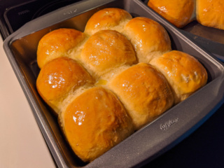
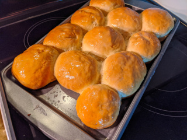

# Standard Bread Rolls

### Time

* 0.5 hour preparation
* 1.5 hour rising
* 0.5 hours minutes baking

### Tools

* tablespoon
* teaspoon
* measuring cup
* 1.5x 12x24inch baking pans
* large bowl + lid
* 2 oven racks
* small bowl
* I like to stir with a smooth metal chopstick!

### Ingredients

Scale | Unit | Ingredient | Note
--- | --- | --- | ---
0.5 | cup | warm water 
4.5 | teaspoon | yeast
2 | cup | warm milk | microwave 45 seconds
6 | tablespoon | shortening | crisco works
2 | large | eggs
0.25 | cup | sugar
1.5 | teaspoon | salt
1.5 | tablespoon | cinnamon
1 | teaspoon | vanilla extract
7.5 | cup | flour
1 | teaspoon | vegetable / olive / coconut oil
4 | tablespoon | honey
4 | tablespoon | butter

### Instructions

###### Making the Dough

1. Stir yeast into warm water.
2. Stir in milk, shortening (may stay lumpy), eggs, sugar, salt, cinnamon, vanilla.
3. Stir in 3 cups flour until smooth.
4. Stir in remaining flour until the dough is thick enough it pulls away from the bowl edges as you stir.
5. Coat your hands in some remaining flour.
6. Knead the dough by folding from far edge and pressing down with your palm.  Rotate the bowl and repeat.
7. Add more dough and repeat from 5, until while still sticky, doesn't glue into your skin.
8. You should have a sticky blob of dough, probably sticking to the bottom, but not to the sides.
9. Cover bowl and let rise for an hour to double in size.  I like to let bowl rest in hot water.
10. Prepare the baking pans with a little bit of vegetable oil brushed over them.
11. Without totally deflating it, coat your hands with flour again and gently peel and knead the dough back into a nice blob.
12. From the dough, gently pull a large handful 3" round, twisting at the base to get a nice ball of dough.
13. Briefly roll the ball between your hands to get a nice ball.  Place the ball into the baking pan with rows of 3.
14. Star the oven preheating to 350 degrees.
15. Allow the rolls to rise for 20-30 minutes.
16. Start the oven timer for 20 minutes.
17. Place the baking pans in oven racks.
18. In a small bowl, heat 4 tablespoons butter in the microwave for 45 seconds.
19. Stir/froth honey into the butter.
20. Near the end of the baking time, watch the rolls closely.  They should be turning golden on top.
21. Pull out when nicely golden, use a spoon to smooth melting honey/butter mixture all over the rolls.
22. Let cool for 10-15 minutes.

VOILA!

- Zac.

